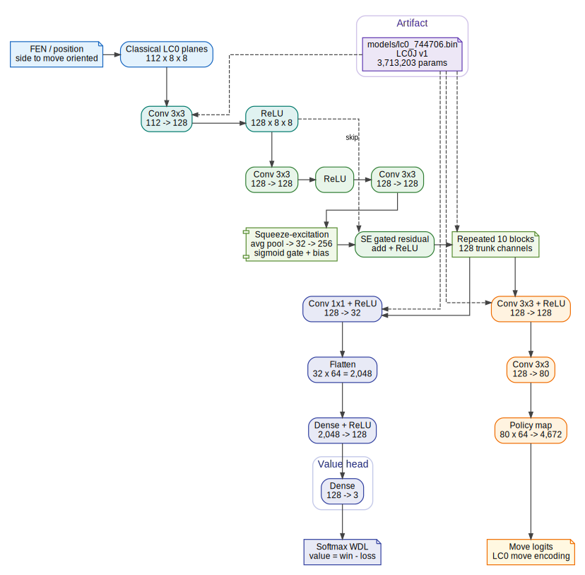

# ChessModels

ChessModels stores chess neural-network weight files and minimal documentation.

The repository is intentionally narrow in scope: it exists to keep large model binaries, hashes, and lightweight metadata in one place.

## What This Repo Is For

- Versioned chess neural-network weight files
- Stable download targets for reproducible setups
- Lightweight metadata for the files in `models/`

## What This Repo Is Not

- A training codebase
- A dataset repository
- A general chess engine toolkit

## Available Weights

| File | Size | SHA-256 | Notes |
| --- | ---: | --- | --- |
| `models/lc0_610153.bin` | 317 MiB | `c4dd6b62acd3c86be3d6199a32d6119d9144f508f84c823f69881ae0bae41034` | LCZero run1 `#610153`, classical `30x384` net converted to LC0J |
| `models/lc0_744706.bin` | 15 MiB | `b99bec1aba97e96bf03ac8e016578527b983b6653f1adf040452f86c6f3ef348` | Small LC0J binary; see `models/README.md` |

## Architecture Diagrams

The diagrams below are rendered from Graphviz `.dot` sources in `assets/`.

### LCZero `#610153`


Source: [`assets/lc0-610153-architecture.dot`](assets/lc0-610153-architecture.dot)

### LCZero `#744706`



Source: [`assets/lc0-744706-architecture.dot`](assets/lc0-744706-architecture.dot)

## Layout

```text
assets/   banner and repository artwork
models/   model binaries and per-file notes
```

## Usage

Clone or download this repository, then use the file you want from `models/`.

If you need the per-model notes, checksums, or provenance that has been documented so far, see [models/README.md](models/README.md).
